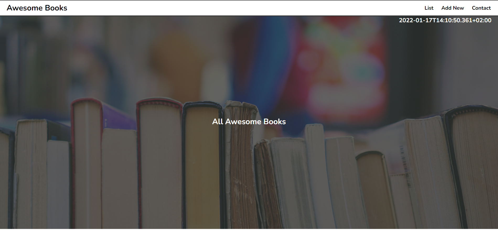

# Awesome books website with ES6.

## Setup

To get a local copy up and running follow these simple example steps.

- Clone the repository to your computer using git clone [Git Clone Url](https://github.com/abdulrahmanshr75/Awesome-Books-ES6.git)
- Cd into the folder
- run npm install to install the node package
- Open index.html with live server
- Or you can Fork it instead, and create a pull request to suggest some changes

## Prerequisites

- Setup
- Install
- Run tests
- Deployment

## Live Demo

[Live Demo]()

## Built With

- HTML
- CSS
- JavaScript
- npm

## technology used

- Linters
- VScode
- html & css
- Javascript
- github

## Authors

👤 Abdulrahman Shrshar

- GitHub: (https://github.com/abdulrahmanshr75)
- LinkedIn: (https://www.linkedin.com/in/abdulrahman-shrshar-721144161/)

## Show your support

- give a thumb 👍 if you like this project

## Contributing

- Contributions, issues, and feature requests are welcome!

## License

- This project is MIT licensed
